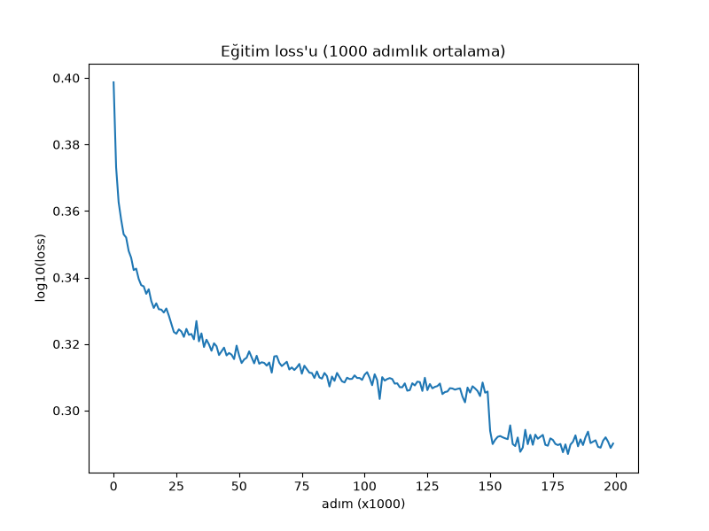
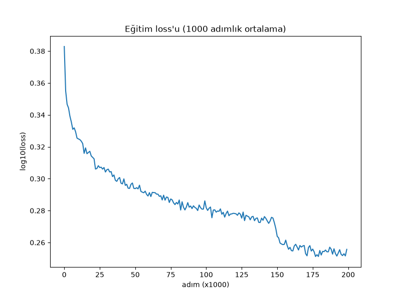
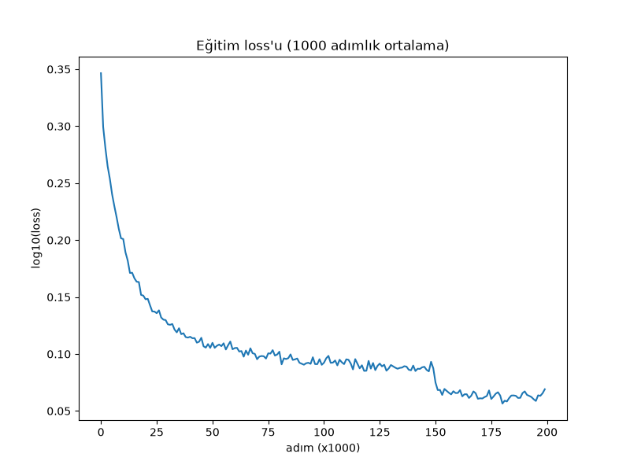

# Hafta 6: WaveNet (makemore Part 5)

## Kaynaklar
- Andrej Karpathy, [Building makemore Part 5: Building a WaveNet](https://www.youtube.com/watch?v=t3YJ5hKiMQ0)
- [Videodaki notebook](https://github.com/karpathy/nn-zero-to-hero/blob/master/lectures/makemore/makemore_part5_cnn1.ipynb)
- [karpathy/makemore](https://github.com/karpathy/makemore)
- van den Oord vd. 2016, [WaveNet: A Generative Model for Raw Audio](https://arxiv.org/abs/1609.03499) (isteğe bağlı)

**Amaç:** iki parça. Birincisi [hafta 4'teki](../week4/README.md) dağınık MLP + BatchNorm kodunu `torch.nn` benzeri sınıflara toplamak: `forward(X, C, W1, b1, W2, b2, bngain, bnbias, running_mean, running_var, training, ...)` gibi 12 argümanlı bir fonksiyon yerine, durumunu kendi içinde taşıyan katmanlar. İkincisi bağlamı 3 harften 8'e çıkarmak ve 8 harfi tek seferde düzleştirmek yerine **ikişer ikişer birleştiren bir ağaç** kurmak (WaveNet).

Bu hafta çözülen görevler:
- **Görev 1:** `Linear`, `BatchNorm1d`, `Tanh`, `Embedding`, `Flatten`, `Sequential`; model tek bir `Sequential`, loss eğrisi düzeltildi
- **Görev 2:** bağlam 3 → 8, başka hiçbir şey değişmeden (karşılaştırma tabanı)
- **Görev 3:** WaveNet, her katmanın çıktı şekli
- **Görev 4:** BatchNorm1d'nin 3 boyutlu girdideki hatası, düzeltmeden önce/sonra
- **Görev 5:** büyütülmüş WaveNet, üç satırlık tablo
- **Görev 6:** Türkçe isimlerle aynı WaveNet

**Konfigürasyon kararı:** karşılaştırmalar videonun konfigürasyonuyla yapıldı. Dropout ve warmup+cosine lr (hafta 4'ün eklemeleri) görev 1-6'da **kullanılmadı**, böylece tablolarda değişen tek şey mimari oldu. Sonradan ikisi de koda eklendi (`DROPOUT_P`, `LR_SCHEDULE`), ama varsayılanları (`0.0`, `"step"`) görev 1-6'daki koşuları birebir tekrarlıyor.

| sabit | değer |
|---|---|
| batch | 32 |
| adım | 200,000 |
| lr | 0.1, 150k. adımdan sonra 0.01 |
| init seed | `torch.manual_seed(42)` |
| split seed | `2147483647` (hafta 4 ile aynı split: %80 / %10 / %10) |

---

## Dosya yapısı

| Dosya | Sorumluluk |
|---|---|
| `dataset.py` | `read_names`, `build_vocab`, `build_dataset`, `split_dataset` (hafta 4'ten, değişmedi) |
| `layers.py` | `Linear`, `Tanh`, `BatchNorm1d`, `Embedding`, `Flatten`, `FlattenConsecutive`, `Sequential`, `Dropout` |
| `lr_scheduler.py` | `warmup_cosine_lr` (hafta 4/5'ten kopya) |
| `main.py` | konfigürasyon, `ARCH` anahtarı (`"flat"` / `"wavenet"`), eğitim döngüsü, `set_training`, `split_loss`, `sample_name`, katman şekillerinin yazdırılması |
| `turkish_wavenet.py` | görev 6: `main.py`'nin Türkçe kopyası; epoch sayısı ve ezber ölçümü ekli |
| `viz.py` | `plot_loss`: 1000 adımlık ortalamayla loss eğrisi |
| `plots/` | koşuların loss eğrileri |
| `names.txt`, `turkish_names.txt` | isim listeleri |

---

## 1. Katman sınıfları (`layers.py`)

Her katman aynı arayüze sahip: `__call__(x)` çıktıyı hesaplar, `self.out`'a saklar ve döndürür; `parameters()` eğitilen tensörlerin listesini döndürür. `Sequential` de aynı arayüzü taşıdığı için dışarıdan bakınca o da bir katman.

| sınıf | durum | `parameters()` | not |
|---|---|---|---|
| `Linear(fan_in, fan_out, bias)` | `weight`, `bias` | ikisi (bias yoksa sadece weight) | init `randn / sqrt(fan_in)` |
| `Tanh` | yok | `[]` | |
| `BatchNorm1d(dim, eps, momentum)` | `bngain`, `bnbias`, `running_mean`, `running_var`, `training` | sadece gain ve bias | running değerler gradient'le değil ortalamayla güncelleniyor |
| `Embedding(num_emb, emb_dim)` | `weight` | `[weight]` | `weight[x]`: `one_hot(x) @ weight`'in ucuz hali |
| `Flatten` | yok | `[]` | `(B, T, C) → (B, T*C)` |
| `FlattenConsecutive(n)` | `n` | `[]` | `(B, T, C) → (B, T/n, C*n)`; `T/n = 1` ise o boyut atılır |
| `Sequential(layers)` | `layers` | tüm katmanların parametreleri, düz liste | |

### 1.1 Constructor argümanı mı, durum mu?

BatchNorm'u yazarken takılınan yer: gain, bias, running mean ve running var constructor'a argüman olarak mı gelmeli? Hayır. Hafta 4'teki `init_batchnorm(hidden_size)` da bunları almıyordu, içeride kurup döndürüyordu. Kural:

- **constructor argümanı:** katmanı *tarif eden* ayarlar (`fan_in`, `dim`, `eps`, `momentum`)
- **`self` üzerindeki durum:** katmanın *sahip olduğu* tensörler (`weight`, `running_mean`)

Durumu dışarıdan almak, sınıfa geçerek kurtulmaya çalıştığımız "tensörleri elde taşıma" sorununu geri getirirdi.

### 1.2 Neden `5/3` gain yok?

Hafta 4'te Kaiming init `(5/3) / sqrt(fan_in)` idi. `1/sqrt(fan_in)`, `fan_in` terimin toplanmasıyla büyüyen varyansı iptal ediyor. `5/3` ise tanh'ın sıkıştırmasını telafi ediyor. 200 genişlikte, BN'siz 5 katmanlık tanh zincirinde:

| gain | katman 1 | 2 | 3 | 4 | 5 |
|---|---|---|---|---|---|
| 1.0 | 0.63 | 0.49 | 0.41 | 0.36 | **0.32** (sönüyor) |
| 5/3 | 0.76 | 0.69 | 0.67 | 0.66 | **0.65** (dengede) |

Bu hafta her `Linear`'ın arkasında BN var. BN çıktıyı kendi std'sine böldüğü için ağırlığı hangi sabitle çarparsan çarp sonuç std 1.000. Gain de, BN'den önceki bias da BN tarafından iptal ediliyor. Bu yüzden `bias=False` ve sade `1/sqrt(fan_in)` kullanıldı.

### 1.3 Son katmanın küçük init'i neden `main.py`'de?

`model.layers[-1].weight *= 0.1` satırı sınıfın içinde değil çünkü `Linear` hangi rolde kullanıldığını bilmiyor: aynı sınıf hem gizli katman hem çıkış katmanı. "Başlangıçta logitler küçük olsun, loss `-log(1/27) = 3.30`'dan başlasın" kararı bu modele özgü. Sıralama da önemli: `requires_grad` açıldıktan sonra yaprak tensörü yerinde değiştirmek hata verir, bu yüzden küçültme önce ve `no_grad` altında yapılıyor. İlk loss: **3.29**.

### 1.4 Eğitim ve tahmin kipi

Hafta 4'te `training` bir fonksiyon argümanıydı. Artık her katmanda bir alan. `set_training(model, mode)` `model.layers` üzerinden hepsini ayarlıyor. `Tanh` ya da `Linear`'a `training` atamak Python'da hata vermiyor; alan oluşur, kimse okumaz. `split_loss` ve `sample_name` iş bitince eğitim kipine **geri dönüyor**, yoksa ara değerlendirmeden sonra eğitim BN'nin running değerleriyle devam ederdi.

Sonuç: eğitim döngüsünde hiçbir katman adı geçmiyor, sadece `model(Xb)`, `parameters` ve `p.grad`.

### 1.5 Loss eğrisi

Adım başına loss 32 örnekten geldiği için çok gürültülü; ham çizim kalın bir bant gibi görünüyor. `plot_loss`, `lossi`'yi `view(-1, 1000).mean(1)` ile 200 satıra dizip her satırın ortalamasını alıyor. 150k. adımdaki lr düşüşü artık net bir basamak:



---

## 2. Bağlam 3 → 8 (görev 1-2)

`main.py`'de sadece `BLOCK_SIZE` değişti. İlk `Linear`'ın girişi `EMB_DIM * BLOCK_SIZE` olarak yazıldığı için model kendiliğinden uyum sağladı.

| | bağlam 3 | bağlam 8 | değişim |
|---|---|---|---|
| Embedding | 270 | 270 | |
| Linear 1 | 30 × 200 = 6,000 | 80 × 200 = 16,000 | +10,000 |
| BN + Linear 2 | 5,827 | 5,827 | |
| **parametre** | **12,097** | **22,097** | **+%83** |
| train | 2.0610 | 1.9204 | −0.141 |
| **dev** | **2.1133** | **2.0332** | **−0.080** |
| makas | 0.052 | 0.113 | ×2 |
| video dev | ~2.10 | ~2.02 | |

- Artışın tamamı tek matristen geliyor: bağlam uzadıkça sadece ilk Linear'ın girişi büyüyor.
- Dev 0.08 düştü. Bağlam gerçekten bilgi taşıyor.
- Makas ikiye katlandı. Train 0.141 düşerken dev 0.080 düştü; eklenen kapasitenin bir kısmı ezbere gitti.
- Örnekler: bağlam 3'te `mychinesianna`, `soleiannah` gibi kopuk uzun isimler; bağlam 8'de `maya`, `zariah`, `lijah`, `angell`.

Sorun: bu 10,000 parametre 8 harfin **hepsini tek adımda** 200 nörona karıştırıyor. Görev 3 bunu sorguluyor.

---

## 3. WaveNet (görev 3)

```
düz MLP:   h e l l o w o r  →  [80]  →  Linear  →  200
WaveNet:   (he)(ll)(ow)(or) →  (hell)(owor)  →  (helloworr)
             4 grup            2 grup            1 vektör
```

Her blok `FlattenConsecutive(2) → Linear(bias yok) → BatchNorm1d → Tanh`. Üç blokta 8 → 4 → 2 → 1. Videodaki boyutlar (emb 10, hidden 68) ile **22,397 parametre**, düz modelin 22,097'sine denk.

### 3.1 Katman şekilleri

İlk eğitim adımında (`i == 0`) yazdırılan şekiller, büyütülmüş model (emb 24, hidden 128):

```
Embedding           : (32, 8, 24)
FlattenConsecutive  : (32, 4, 48)
Linear              : (32, 4, 128)
BatchNorm1d         : (32, 4, 128)  running_mean: (128,)
Tanh                : (32, 4, 128)
FlattenConsecutive  : (32, 2, 256)
Linear              : (32, 2, 128)
BatchNorm1d         : (32, 2, 128)  running_mean: (128,)
Tanh                : (32, 2, 128)
FlattenConsecutive  : (32, 256)
Linear              : (32, 128)
BatchNorm1d         : (32, 128)  running_mean: (128,)
Tanh                : (32, 128)
Linear              : (32, 27)
```

<!-- Görev 3 şekillerin nedenini "kendi cümlelerinle" yazmanı istiyor. Aşağıdaki açıklamayı kendi ifadenle değiştir. -->

**Ortadaki boyut (8 → 4 → 2 → yok):** her `FlattenConsecutive(2)` komşu iki grubu birleştiriyor, grup sayısı yarıya iniyor. 1'e indiğinde o boyut atılıyor ve tensör düz MLP'deki gibi `(B, C)` oluyor.

**Son boyut (24 → 48 → 128 → 256 → 128 → 256 → 128 → 27):** `FlattenConsecutive` iki vektörü yan yana eklediği için kanal sayısını ikiye katlıyor. `Linear` ise onu tekrar `HIDDEN_SIZE`'a indiriyor. İlk blokta birleşen şey iki harfin embedding'i (2 × 24), sonrakilerde iki gizli vektör (2 × 128).

**Linear 3 boyutlu girdide nasıl çalışıyor:** `(32, 4, 48) @ (48, 128)` sonucu `(32, 4, 128)`. `@` son boyutta çarpıyor, öndeki boyutları batch gibi taşıyor. `Linear` sınıfı hiç değişmedi. Önemli sonucu: **4 grubun hepsine aynı ağırlıklar uygulanıyor.** (h,e) çiftini işleyen matris (l,l) çiftini de işliyor. WaveNet'in az parametreyle çalışmasının nedeni bu paylaşım: 8 harfin her konumu için ayrı ağırlık yok, "iki şeyi birleştir" işlemi için tek bir ağırlık var.

### 3.2 `FlattenConsecutive` neden `view` ile çalışıyor

`(2, 8, 2)` şeklinde `arange` tensörüyle:

```
FlattenConsecutive(2) → (2, 4, 4)
[[ 0,  1,  2,  3],     ← 1. ve 2. harf
 [ 4,  5,  6,  7],     ← 3. ve 4. harf
 [ 8,  9, 10, 11],
 [12, 13, 14, 15]]
```

Bellekte her örneğin harfleri zaten sırayla duruyor; `view` hiçbir şeyi taşımadan komşu vektörleri yan yana okuyor. `FlattenConsecutive(8)` ile eski `Flatten` birebir aynı sonucu veriyor.

---

## 4. BatchNorm'un 3 boyutlu girdideki hatası (görev 4)

Görev 3'teki ilk koşuda şekil çıktısı şuydu:

```
BatchNorm1d         : (32, 4, 68)  running_mean: (4, 68)   ← (68,) olmalı
BatchNorm1d         : (32, 2, 68)  running_mean: (2, 68)   ← (68,) olmalı
BatchNorm1d         : (32, 68)     running_mean: (68,)
```

### 4.1 Hata ne

BN'nin amacı her **kanalın** ortalamasını 0, varyansını 1 yapmak. Her kanal için tek bir istatistik gerekiyor.

- 2 boyutlu `(32, 68)`: her kanalın 32 değeri var. `mean(0)` doğru.
- 3 boyutlu `(32, 4, 68)`: her kanalın **32 × 4 = 128** değeri var. 4 grup da aynı `Linear`'dan geçti (3.1'deki ağırlık paylaşımı), yani 5 numaralı kanal 4 grupta da aynı özelliği ölçüyor. Ama `mean(0)` sadece batch ekseninde ortalama alıp `(4, 68)` üretiyor: her grup için ayrı istatistik.

İki kötü sonucu var:
1. Her istatistik 128 yerine 32 değerden geliyor, 4 kat daha gürültülü.
2. Aynı özellik gruba göre farklı ölçekleniyor; model bu tutarsızlığa uyum sağlamak zorunda kalıyor.

### 4.2 Neden sessiz

`running_mean` `(68,)` başlıyor. İlk güncellemede `(68,) + (4, 68)` broadcasting ile `(4, 68)` oluyor. Normalizasyonda `(32, 4, 68) - (4, 68)` yine çalışıyor. Hiçbir yerde şekil uyuşmazlığı yok; tek belirti istatistik tensörünün şeklinin sessizce değişmesi. `bngain` ve `bnbias` baştan `(68,)` olduğu için parametre sayısı da değişmedi.

### 4.3 Düzeltme

Ortalama kanal hariç tüm eksenlerde alınıyor:

```python
if x.ndim == 2:
    dim = 0
elif x.ndim == 3:
    dim = (0, 1)
self.bnmean = x.mean(dim)
self.bnvar = x.var(dim, unbiased=True)
```

Düzeltmeden sonra üç BN'nin `running_mean`'i de `(68,)`.

### 4.4 Önce / sonra

WaveNet, emb 10, hidden 68, 22,397 parametre, 200k adım:

| | train | dev | makas | video dev |
|---|---|---|---|---|
| hatalı BN (`mean(0)`) | 1.9405 | **2.0267** | 0.086 | 2.029 |
| düzeltilmiş BN (`mean((0, 1))`) | 1.9115 | **2.0193** | 0.108 | 2.022 |

Düzeltme dev'i **0.0074** düşürdü; videodaki fark 0.007. Init ve batch sırası seed'li olduğu için fark düzeltmeden geliyor; tek seed'lik bir ölçüm olduğunu da not etmek gerek.

`torch.nn.BatchNorm1d` 3 boyutlu girdiyi `(B, C, T)` düzeninde bekliyor (kanal ortada). Bizim `(B, T, C)` tensörümüzü doğrudan verseydik T'yi kanal sanardı.

---

## 5. Büyütme ve üç satırlık tablo (görev 5)

WaveNet emb 24, hidden 128 ile büyütüldü. Diğer iki satır görev 1 ve 2'deki modeller.

| model | parametre | dev loss |
|---|---|---|
| bağlam 3, düz MLP | 12,097 | 2.1133 |
| bağlam 8, düz MLP | 22,097 | 2.0332 |
| bağlam 8, WaveNet (emb 24, hidden 128) | 76,579 | **1.9876** |

Videodaki son sayı 1.993. İlk kez 2.0'ın altı; hafta 4'ün en iyisi (1.996) dropout ve ayarlamayla alınmıştı, burada sadece mimari değişti.

### 5.1 Tablo ne söylemiyor

3. satır iki şeyi birden değiştiriyor: mimari **ve** boyut. Mimarinin kendi katkısı için eşit bütçe gerekiyor, o da görev 4'te var:

| 22k parametrede | dev |
|---|---|
| düz MLP, bağlam 8 | 2.0332 |
| WaveNet, bağlam 8 | 2.0193 |

Aynı bütçede WaveNet'in avantajı **0.014**. Kalan 0.031 büyütmeden geliyor.

### 5.2 Makas

| model | train | dev | makas |
|---|---|---|---|
| düz MLP, 12k | 2.0610 | 2.1133 | 0.052 |
| düz MLP, 22k | 1.9204 | 2.0332 | 0.113 |
| WaveNet, 22k | 1.9115 | 2.0193 | 0.108 |
| WaveNet, 77k | 1.7678 | 1.9876 | **0.220** |

Kapasite arttıkça makas açılıyor; düzenlileştirme yok. Hafta 4'teki desen. 7c için doğal başlangıç: dropout.

Örnekler (büyük WaveNet): `sriya`, `yalinea`, `zyrabelle`, `izalea`, `dezleigh`, `kahlil`, `noeli`.



---

## 6. Türkçe (görev 6)

`turkish_wavenet.py`, `main.py`'nin kopyası. Farklar:

- **Adım bütçesi.** Türkçe train setinde 18,441 örnek var (İngilizce 182,535). 200k adım Türkçe'de ~347 epoch, İngilizce'de ~35. Varsayılan `TOTAL_STEPS = 20000`: İngilizce 200k koşusuyla aynı epoch sayısı. lr düşüşü aynı oranda (%75).
- **Ezber ölçümü.** Model 200 isim üretiyor ve kaçının train setinde birebir bulunduğunu sayıyor. Hafta 4'te önerilip yapılmayan ölçüm.
- vocab 30 (ç, ğ, ı, ö, ş, ü dahil, q/w/x yok), bu yüzden son katman 30 logit.

### 6.1 Sonuçlar

| model | parametre | adım | epoch | train | dev | makas | train'den kopya |
|---|---|---|---|---|---|---|---|
| hafta 4 MLP, bağlam 3, dropout 0.2 | | 30k (batch 128) | | 1.8706 | **2.0358** | 0.165 | |
| düz MLP, bağlam 3 (emb 24, h 200) | 21,550 | 20k | 35 | 1.6881 | 2.0584 | 0.370 | %16 |
| WaveNet küçük (emb 10, h 68) | 22,634 | 20k | 35 | 1.5276 | 2.0528 | 0.525 | %30 |
| WaveNet büyük (emb 24, h 128) | 77,038 | 20k | 35 | 1.2987 | 2.0623 | 0.764 | %56 |
| WaveNet büyük | 77,038 | 200k | **347** | 1.1555 | **2.6277** | **1.472** | **%94** |

Örnekler (büyük WaveNet, 20k): `ercan`, `haşmet`, `neriman`, `gürkan`, `ümmiye`, `zümriye`, `leylo`, `şahizah`, `birşad`, `ruhsine`. Çok Türkçe görünüyor, ama yarısından fazlası train setinden birebir kopya.

### 6.2 Bağlam 8 Türkçe'de ne kazandırdı

<!-- Görev 6 bu sorunun cevabını senin yazmanı istiyor. Aşağıdaki gözlemleri kendi cümlelerinle yorumla. -->

**Kazandırmadı.** Gözlemler:

1. **Görevin tarif ettiği koşu (aynı WaveNet, 200k adım) çöküyor.** 347 epoch'ta model ürettiği isimlerin %94'ünü train'den kopyalıyor, dev 2.63 ile hafta 3'ün bigram'ından kötü. Train eğrisi ise kusursuz görünüyor; tek başına eğriye bakarak bunu görmek mümkün değil:

   

2. **Epoch eşitlenince bile bağlam 8 kazandırmıyor.** ~22k parametrede bağlam 3 düz MLP 2.0584, bağlam 8 WaveNet 2.0528: fark 0.006, gürültü düzeyinde. Ama WaveNet'in makası (0.53 / 0.37) ve kopyalama oranı (%30 / %16) neredeyse iki katı. 8 harf kısa bir Türkçe ismin neredeyse tamamı; model ek bağlamı ismi tanıyıp hatırlamak için kullanıyor.
3. **Büyütmek Türkçe'de ters etki yapıyor.** 22k → 77k dev'i 2.053'ten 2.062'ye çıkarıyor. İngilizce'de aynı büyütme 0.03 kazandırmıştı.
4. **Kazandıran şey düzenlileştirme.** En iyi sonuç hâlâ hafta 4'ün dropout'lu küçük MLP'si. Hafta 4'teki bulgu burada daha sert görünüyor: öğrenen modeller veri miktarına bağımlı. 3,329 isimde darboğaz bağlam ya da mimari değil, veri.

İngilizce ile karşılaştırma:

| | İngilizce | Türkçe |
|---|---|---|
| train örneği | 182,535 | 18,441 |
| bağlam 3 → 8 WaveNet (eşit epoch) | 2.1133 → 1.9876 (**−0.126**) | 2.0584 → 2.0528 (−0.006) |
| büyük WaveNet makası | 0.220 | 0.764 |

---

## 7. Sonuçların özeti

| model | veri | parametre | dev |
|---|---|---|---|
| düz MLP, bağlam 3 | İng | 12,097 | 2.1133 |
| düz MLP, bağlam 8 | İng | 22,097 | 2.0332 |
| WaveNet, hatalı BN | İng | 22,397 | 2.0267 |
| WaveNet, düzeltilmiş BN | İng | 22,397 | 2.0193 |
| WaveNet, büyük | İng | 76,579 | **1.9876** |
| WaveNet, büyük, 20k adım | Tr | 77,038 | 2.0623 |
| hafta 4 MLP (referans) | Tr | | **2.0358** |

Test setine bu hafta bakılmadı; hiperparametre kararları (7c) bitince bir kez bakılacak.

---

## 8. Karşılaşılan hatalar

| # | hata | belirti | sebep |
|---|---|---|---|
| 1 | `Linear` init'inde `//` | tüm ağırlıklar 0, çıktı std 0.0 | taban bölmesi: `0.73 // 5.47 = 0` |
| 2 | `Linear` init'inde `torch.rand` | (1 ile birlikte gizlendi) | `rand` [0, 1) düzgün dağılım, ortalama 0.5; Kaiming ortalama 0 varsayıyor → `randn` |
| 3 | BN'de `x.dim == 2` | hiçbir dal tutmaz, `NameError` | `dim` bir metot; parantezsiz metodun kendisi 2 ile karşılaştırılıyor → `x.ndim` |
| 4 | `runnning_var` | ileride `AttributeError` | yazım hatası |
| 5 | BN `__call__`'da normalizasyon ve `return` yok | `bn(x)` `None` döndürüyor | `return` olmayan fonksiyon `None` döndürür |
| 6 | BN'de `- self.bnbias` | testler geçiyor, beta 2 iken çıktı ortalaması −2 | beta 0'dan başladığı için `+0` ve `−0` aynı; sıfırdan başlayan parametre testte sıfır olmayan değerle denenmeli |
| 7 | `class Embeding` | `ImportError` | yazım hatası |
| 8 | `Flatten`'da `x.view(B, T, C)` | şekil değişmiyor | hedef `(B, T*C)` |
| 9 | ilk model üç bloklu, `Linear(EMB_DIM, VOCAB_SIZE)` | `mat1 and mat2 shapes cannot be multiplied (32x30 and 10x27)` | `fan_in` Flatten çıkışı olmalı (`EMB_DIM * BLOCK_SIZE`), `fan_out` sonraki BN'in boyutu; ikinci `Flatten` 2D girdide patlar |
| 10 | init seed'lenmemiş | her koşu farklı ağırlıkla başlıyor | generator sadece `split_dataset`'e gidiyordu; `Linear`/`Embedding` global `randn` kullanıyor |
| 11 | BN 3D girdide `mean(0)` | hata yok; `running_mean` `(4, 68)` | görev 4 |

---

## 9. Hafta 4'ten gelen eklemeler: dropout ve warmup + cosine

`main.py` ve `turkish_wavenet.py`'de yeni sabitler:

| sabit | varsayılan | anlamı |
|---|---|---|
| `DROPOUT_P` | `0.0` | her `Tanh`'tan sonra bir `Dropout` katmanı |
| `LR_SCHEDULE` | `"step"` | `"step"`: LR → LR_DECAYED; `"warmup_cosine"`: hafta 4'teki scheduler |
| `WARMUP_STEPS` | 200 | sadece `warmup_cosine` |
| `LR_MIN` | 0.0 | sadece `warmup_cosine` |

- **`Dropout` bir katman.** Hafta 4'te `dropout(h, p, training)` fonksiyonuydu; şimdi `training` alanı olan bir sınıf, `set_training` onu da kapsıyor. Inverted dropout: eğitimde kalan nöronlar `1/(1-p)` ile büyütülüyor, tahmin kipinde hiçbir şey yapmıyor.
- **p = 0 iken rastgele sayı çekmiyor.** Yoksa global RNG kayar, sonraki batch'ler farklı olur ve eski koşular tekrarlanamazdı. Doğrulama: 2000 adımlık koşu, eklemelerden önce ve sonra train 2.2368 / dev 2.2406, birebir aynı.
- **Konum:** WaveNet'te üç blokun her birinin sonunda, düz MLP'de çıkış katmanından önce.
- **`get_lr(step)`** eğitim döngüsündeki tek satırı seçilen stratejiye yönlendiriyor.

## 10. Görev 7 (ek)

Henüz yapılmadı. Seçenekler: (a) `torch.nn.Conv1d` ile dilated causal convolution, (b) konfigürasyon listesinden deney düzeneği, (c) Karpathy'nin 1.993'ünü geçmek.
