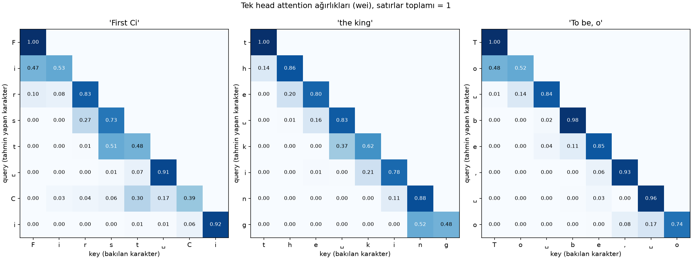

# Hafta 7: Self-attention (Let's build GPT, ilk bölüm)

## Kaynaklar
- Andrej Karpathy, [Let's build GPT: from scratch, in code, spelled out](https://www.youtube.com/watch?v=kCc8FmEb1nY) (0:00 – 1:22)
- [karpathy/ng-video-lecture](https://github.com/karpathy/ng-video-lecture)
- Vaswani vd. 2017, [Attention Is All You Need](https://arxiv.org/abs/1706.03762) (isteğe bağlı)

**Amaç:** isimlerden (hafta 3-6) metne geçmek ve bir karakterin tahmin yaparken **geçmişteki karakterlere bakabildiği** ilk mekanizmayı kurmak. Önce bigram tabanı kuruluyor (her karakter sadece bir öncekine bakıyor), sonra "geçmişin ortalaması" fikri matris çarpımına dönüştürülüyor, en sonda ortalamanın ağırlıklarını verinin kendisinin belirlediği tek bir attention head yazılıyor.

Bu hafta çözülen görevler:
- **Görev 1:** Tiny Shakespeare, karakter tokenizer, ardışık %90 / %10 split, `get_batch`, bigram `nn.Module`, AdamW ile eğitim, val loss tabanı
- **Görev 2:** geçmişin ortalaması üç yolla (for döngüsü, `tril` matmul, softmax), `torch.allclose`
- **Görev 3:** tek head: Q / K / V, `wei` satırını okumak, `/ sqrt(head_size)` ölçeklemesinin sayısal gösterimi
- **Görev 4:** head'i modele koymak (pozisyon embedding ile), val loss karşılaştırması, `generate`'te `block_size` kırpması
- **Ek (a):** eğitilmiş modelde attention ısı haritası

| sabit | değer |
|---|---|
| batch | 4 |
| `block_size` (bağlam) | 8 |
| `n_embd` | 32 |
| adım | 100,000 |
| optimizer | AdamW, lr 1e-3 (varsayılan) |
| `estimate_loss` | her split için 200 batch'in ortalaması, her 10k adımda |

Batch 4 videodaki küçük deney ayarı; GPU'suz makinede 100k adım ~1:40 sürüyor. Bu boyutta ölçüm gürültüsü yaklaşık **±0.03**: bundan küçük farklar sonuç sayılmadı.

---

## Dosya yapısı

| Dosya | Sorumluluk |
|---|---|
| `dataset.py` | `read_text`, `Tokenizer` (`encode` → tensor, `decode` tensor ya da liste alır), `Dataset` (split, `get_batch('train' \| 'val')`) |
| `layers.py` | `Head` (causal self-attention), `BigramLanguageModel` (embedding + head + `lm_head`, `generate`) |
| `main.py` | hiperparametreler, eğitim döngüsü, `estimate_loss`, eğitim sonunda `head_model.pt` kaydı |
| `attention_map.py` | `head_model.pt`'yi yükler, örnek metinler için `wei` matrisini çizer |
| `plots/attention_map.png` | ek (a) çıktısı |
| `input.txt` | Tiny Shakespeare (1,115,394 karakter) |

Görev 2 ve 3 tek seferlik deney dosyalarında yapıldı, repoya alınmadı. Sonuçları aşağıda.

---

## 1. Veri ve bigram tabanı (görev 1)

### 1.1 Tokenizer

Karakter düzeyinde: metindeki her farklı karakter bir token. Sıralı `set(text)` **65** karakter veriyor:

```
\n !$&',-.3:;?ABCDEFGHIJKLMNOPQRSTUVWXYZabcdefghijklmnopqrstuvwxyz
```

`stoi` / `itos` iki sözlük. `encode` doğrudan `torch.long` tensörü döndürüyor, `decode` tensör ya da liste kabul ediyor. 2 boyutlu tensör kabul etmiyor; bu yüzden `generate` çıktısı `decode(out[0])` ile çözülüyor (batch'in ilk satırı).

Hafta 3-6'daki isim modellerinden fark: orada her isim ayrı bir örnekti ve `.` ile başlayıp bitiyordu. Burada metin **tek uzun dizi**; özel başlangıç / bitiş token'ı yok.

### 1.2 Split ve `get_batch`

İlk %90 train (1,003,854 karakter), son %10 val (111,540). Split **ardışık**, karıştırılmış değil: metni rastgele bölmek val'deki cümlelerin parçalarını train'e sızdırırdı.

`get_batch` metinde rastgele `batch_size` başlangıç noktası seçiyor, her birinden `block_size` uzunluğunda `x` ve bir kaydırılmış `y` alıyor:

```
x: [F, i, r, s, t, ␣, C, i]
y: [i, r, s, t, ␣, C, i, t]
```

Tek bir `(x, y)` çifti aslında **8 ayrı örnek**: `F → i`, `Fi → r`, `Fir → s`, …, `First Ci → t`. Model bağlamı 1'den 8'e kadar her uzunlukta görüyor. `generate`'in 1 token'la başlayabilmesinin nedeni bu.

### 1.3 Bigram modeli

```python
self.emb = nn.Embedding(vocab_size, vocab_size)     # 65 × 65 = 4,225 parametre
logits = self.emb(idx)                              # (B, T) -> (B, T, 65)
```

Tablonun her satırı "bu karakterden sonra hangisi gelir" logit'leri. Hafta 3'teki sayım tablosunun öğrenilen hali. `forward`, `cross_entropy` için `(B, T, C)`'yi `(B*T, C)`'ye düzleştiriyor; `targets=None` ise loss hesaplamadan logit döndürüyor (`generate` bunu kullanıyor).

**Başlangıç loss'u:** `-ln(1/65) = 4.17`. İlk ölçüm 4.22, rastgele init'in hafif dengesizliği.

### 1.4 B, T, C

Haftanın her yerinde aynı üç boyut:

| | anlamı | burada |
|---|---|---|
| **B** | batch'teki bağımsız dizi sayısı; birbirleriyle hiç konuşmuyorlar | 4 |
| **T** | bir dizideki zaman adımı (konum) | 8 |
| **C** | her konumdaki vektörün boyutu (kanal) | 65 (bigram), 32 (`n_embd`), 16 (`head_size`) |

`logits[2, 5, :]`: batch'teki 3. dizinin 6. konumunda, bir sonraki karakter için 65 logit. Attention'ın yaptığı tek şey **T ekseni boyunca** bilgi taşımak; B ekseninde hiçbir şey karışmıyor.

### 1.5 Sonuç

| | train | val |
|---|---|---|
| bigram | ~2.46 | **~2.50** |

Bigram yalnızca bir önceki karaktere baktığı için ürettiği metin harf düzeyinde makul ama kelime düzeyinde yapı taşımıyor.

---

## 2. Geçmişin ortalaması: üç yol (görev 2)

Hedef: her `t` konumu için `x[b, :t+1]`'in ortalaması. Geleceğe bakmak yok. Oyuncak tensör `(B, T, C) = (4, 8, 2)`.

**Yol 1: for döngüsü.** Tanımın kendisi:

```python
for b in range(B):
    for t in range(T):
        xbow1[b, t] = x[b, :t+1].mean(dim=0)
```

**Yol 2: alt üçgen matris çarpımı.**

```python
wei = torch.tril(torch.ones(T, T))
wei = wei / wei.sum(1, keepdim=True)
xbow2 = wei @ x                      # (T, T) @ (B, T, C) -> (B, T, C)
```

`T = 4` için `wei`:

```
[[1.00, 0.00, 0.00, 0.00],
 [0.50, 0.50, 0.00, 0.00],
 [0.33, 0.33, 0.33, 0.00],
 [0.25, 0.25, 0.25, 0.25]]
```

**Matris çarpımı = ağırlıklı ortalama:** çıktının `t`. satırı, `x`'in satırlarının `wei[t]` ağırlıklarıyla toplamı. `wei[t]`'nin elemanları toplamı 1 ve `t`'den sonrası 0 olduğu sürece sonuç "geçmişin ağırlıklı ortalaması". Satırı eşit paylara bölmek düz ortalamayı veriyor; payları değiştirmek başka bir ortalama veriyor. Çarpım tek bir `(T, T)` matrisi bütün batch'e uyguluyor (broadcasting).

**Yol 3: softmax.**

```python
wei = torch.zeros(T, T)
wei = wei.masked_fill(tril == 0, float('-inf'))
wei = torch.softmax(wei, dim=-1)
```

`-inf`'in üssü 0, bu yüzden gelecek tam olarak 0 ağırlık alıyor. Kalan sıfırlar eşit pay alıyor, sonuç yol 2 ile aynı matris. Bu yolun önemi: `zeros` yerine **veriden hesaplanan skorlar** konduğunda, maske ve normalizasyon aynen işlemeye devam ediyor. Görev 3 tam bunu yapıyor.

```
torch.allclose(xbow1, xbow2)  → True
torch.allclose(xbow1, xbow3)  → True
```

---

## 3. Tek head (görev 3)

`(B, T, C) = (4, 8, 32)`, `head_size = 16`.

```python
k = key(x)                                         # (B, T, 16)  "bende ne var"
q = query(x)                                       # (B, T, 16)  "ne arıyorum"
wei = q @ k.transpose(-2, -1) * head_size**-0.5    # (B, T, 16) @ (B, 16, T) -> (B, T, T)
wei = wei.masked_fill(tril == 0, float('-inf'))
wei = F.softmax(wei, dim=-1)
v = value(x)                                       # (B, T, 16)  "bakılırsam ne veririm"
out = wei @ v                                      # (B, T, T) @ (B, T, 16) -> (B, T, 16)
```

- `wei[b, i, j]`: `b` dizisinde `i` konumunun `j` konumuna verdiği ağırlık. `q[i]` ile `k[j]`'nin iç çarpımı ne kadar büyükse o kadar çok.
- Görev 2'den farkı: `wei` artık `(T, T)` değil `(B, T, T)`. Her dizinin içeriği farklı, dolayısıyla her dizinin kendi ağırlık matrisi var.
- `out` hesaplanırken `x` değil `v` toplanıyor. Bir token'ın "dikkat çekme sebebi" (key) ile "aktardığı bilgi" (value) ayrı şeyler.

### 3.1 `wei` satırını okumak

Eğitilmemiş head'de `wei[0]`:

```
[[1.00, 0.00, 0.00, 0.00, 0.00, 0.00, 0.00, 0.00],
 [0.40, 0.60, 0.00, 0.00, 0.00, 0.00, 0.00, 0.00],
 [0.31, 0.29, 0.40, 0.00, 0.00, 0.00, 0.00, 0.00],
 [0.32, 0.22, 0.24, 0.21, 0.00, 0.00, 0.00, 0.00],
 [0.15, 0.20, 0.17, 0.15, 0.34, 0.00, 0.00, 0.00],
 [0.13, 0.25, 0.13, 0.11, 0.31, 0.07, 0.00, 0.00],
 [0.16, 0.20, 0.11, 0.11, 0.14, 0.17, 0.11, 0.00],
 [0.08, 0.12, 0.11, 0.15, 0.11, 0.11, 0.16, 0.16]]
```

Son satır, 8. token'ın geçmişteki 8 token'a (kendisi dahil) dağıttığı ağırlık. Toplam 1, üst üçgen 0. Görev 2'deki düz ortalamadan (her biri 0.125) hafifçe sapıyor: ağırlıklar artık rastgele ağırlıklı `key` / `query`'den geliyor. Eğitimden sonra aynı satırların nasıl değiştiği 5. bölümde.

### 3.2 Neden `/ sqrt(head_size)`

`q` ve `k` birim varyanslı rastgele tensörler:

| | varyans |
|---|---|
| `k`, `q` | 1.04, 1.07 |
| `q @ kᵀ` | **17.47** |
| `q @ kᵀ / sqrt(16)` | **1.09** |

İç çarpım 16 terimin toplamı, her terimin varyansı ~1, toplamın varyansı ~16. Ölçeklemeden softmax'a büyük sayılar giriyor ve softmax büyük girdide **tek değere yakınsıyor**:

```
softmax([0.1, -0.2, 0.3, -0.2, 0.5])      → [0.19, 0.14, 0.24, 0.14, 0.29]
softmax([0.1, -0.2, 0.3, -0.2, 0.5] * 8)  → [0.03, 0.00, 0.16, 0.00, 0.80]
```

İkinci satırda her token neredeyse tek bir token'a bakıyor. Başlangıçta bu kötü: hangi token'a bakılacağı daha öğrenilmeden seçilmiş oluyor ve softmax'ın gradient'i doymuş bölgede küçük. Ölçekleme `wei`'nin varyansını 1 civarında tutuyor, başlangıç dağılımı yumuşak kalıyor. Hafta 4'teki Kaiming init ile aynı fikir: bir toplamın varyansını terim sayısının kökü kadar düzelt.

---

## 4. Head'i modele koymak (görev 4)

### 4.1 `Head` sınıfı

```python
class Head(nn.Module):
    def __init__(self, n_embd, head_size, block_size):
        ...
        self.register_buffer('tril', torch.tril(torch.ones(block_size, block_size)))

    def forward(self, x):
        B, T, C = x.shape
        ...
        wei = wei.masked_fill(self.tril[:T, :T] == 0, float("-inf"))
```

- **`register_buffer`, `nn.Parameter` değil:** `tril` eğitilmiyor, optimizer onu görmemeli. Ama modelin bir parçası: `state_dict`'e giriyor (checkpoint ile kaydediliyor) ve `.to(device)` ile birlikte taşınıyor. Düz `self.tril = ...` ikisini de yapmazdı.
- **`[:T, :T]`:** buffer `(block_size, block_size)`, ama gelen dizi daha kısa olabilir. `generate` 1 token'la başlıyor ve her turda T'yi 1 artırıyor. Test: `block_size = 8`, `T = 5` girdiyle çıktı `(4, 5, 16)`.
- **Ölçek `k.shape[-1]**-0.5`:** `head_size`'ı ayrıca saklamaya gerek bırakmıyor.

### 4.2 Model

`BigramLanguageModel` adı korundu ama artık bigram değil:

```
idx (B, T)
 → token_emb(idx)              (B, T, 32)
 + pos_emb(arange(T))          (T, 32)        broadcasting: aynı konum vektörü her diziye
 → sa_head                     (B, T, 32)     head_size = n_embd
 → lm_head                     (B, T, 65)     logits
```

| katman | şekil | parametre |
|---|---|---|
| `token_emb` | 65 × 32 | 2,080 |
| `pos_emb` | 8 × 32 | 256 |
| `sa_head` key / query / value | 3 × (32 × 32) | 3,072 |
| `lm_head` | 32 × 65 + 65 | 2,145 |
| **toplam** | | **7,553** |

**Pozisyon embedding neden gerekli:** attention bir **küme** üzerinde çalışıyor. `wei` iç çarpımlardan hesaplanıyor, iç çarpım ise vektörlerin sırasını bilmiyor. Pozisyon bilgisi olmadan "2 önceki karakter" ile "7 önceki karakter" aynı görünürdü. `pos_emb`, her konuma öğrenilen bir vektör ekleyerek sırayı içeriğe gömüyor.

**`head_size = n_embd`:** head'in çıktısı doğrudan `lm_head`'e giriyor; boyutlar eşit olunca araya ek katman gerekmiyor.

### 4.3 `generate`'te kırpma

```python
idx_cond = idx[:, -self.block_size:]   # (B, min(T, block_size))
logits, _ = self(idx_cond)
...
idx = torch.cat((idx, idx_next), dim=-1)
```

Kırpma olmadan 9. turda `T = 9` olur, `pos_emb(arange(9))` 8 numaralı satırı ister ama tabloda sadece 0-7 var: `IndexError`. Model en fazla `block_size` konum tanıyor, o yüzden modele sadece son `block_size` token gösteriliyor. `cat` ise kırpılmamış `idx`'e yapılıyor: kırpma modele ne gösterildiğini değiştiriyor, üretilen metnin tamamı yine `idx`'te birikiyor. `T < block_size` iken `[:, -8:]` hata vermiyor, tensörün hepsini döndürüyor.

Bigram'da bu sorun yoktu: `pos_emb` yoktu ve her konum sadece kendi token'ına bakıyordu.

### 4.4 Sonuç

| model | parametre | train | val |
|---|---|---|---|
| bigram (görev 1) | 4,225 | ~2.46 | ~2.50 |
| embedding + tek head | 7,553 | 2.32 – 2.37 | **2.35 – 2.38** |

İki koşu yapıldı (2.38 ve 2.35); fark gürültü içinde. Bigram'a göre ~0.13 düşüş, gürültünün dört katı. Videodaki tek head sonucu da ~2.4.

- **Loss ~10k adımda platoya giriyor**, sonrası 2.33 ile 2.41 arasında gidip geliyor.
- **Train ve val çok yakın** (fark < 0.04): ezber yok. Sorun overfitting değil underfitting; model kapasitesinin sınırında.

Örnek (300 karakter):

```
CKETY Betchee.

ETIOY rolound eathindo
Lef te thil.

Fird icthis ter; bea yonsenimser se aly hare ancey mou ber soksisl ito'ls to ghe gne ds I art orvere nomif thisanche
Watere ath; fer
wis ges, lode ish rithro bie mer nof bly arisoti;
```

Hâlâ kelime yok ama yapı belirginleşiyor: büyük harfle yazılmış karakter adları, kısa satırlar, `the`, `this`, `I` gibi sık kelimeler.

---

## 5. Attention ısı haritası (ek a)

`attention_map.py`, `main.py`'nin kaydettiği `head_model.pt`'yi yüklüyor ve `Head.forward`'daki adımları tekrarlayıp softmax sonrası `wei`'yi döndürüyor (`Head` sınıfı değişmedi). Üç örnek metin, her biri `block_size` uzunluğunda:



Satır: tahmin yapan karakter (query). Sütun: baktığı karakter (key). Her satırın toplamı 1, üst üçgen maske yüzünden 0.

**Gözlem: attention neredeyse tamamen yerel.** Ağırlığın çoğu köşegende (karakter kendine bakıyor), kalanı 1-2 önceki karakterde. 3 ve daha uzak geri pozisyonlar neredeyse hiç ağırlık almıyor. 3.1'deki eğitilmemiş head'in son satırı 8 konuma ~0.12 ile yayılıyordu; eğitim bu dağılımı köşegene toplamış.

Dikkat çeken satırlar:
- `'First Ci'`, **`C`** satırı: `t` 0.30, `␣` 0.17, `C` 0.39. Diğer satırlardan çok daha dağınık. `C` yeni bir kelimenin ilk harfi; tek başına bir sonraki harf hakkında az bilgi veriyor, model önceki kelimenin sonuna da bakıyor.
- `'the king'`, **`k`** satırı: boşluğa 0.37. Kelime başında "bir önceki karakter boşluktu" bilgisi işe yarıyor.
- Noktalama ve boşluk satırları (`,` 0.93, `␣` 0.96) neredeyse sadece kendine bakıyor: boşluktan sonra ne geleceğini belirleyen şey büyük ölçüde boşluğun kendisi.

### 5.1 `block_size` 8 → 16

Isı haritasındaki yerel bakışı sınamak için bağlam iki katına çıkarıldı:

| `block_size` | val |
|---|---|
| 8 | 2.35 – 2.38 |
| 16 | 2.36 |

Fark yok. Model 8 karakterin zaten sadece son 1-2'sini kullanıyordu; pencereyi büyütmek kullanılmayan geçmişi uzatıyor. Darboğaz bağlamın uzunluğu değil, modelin uzak bağlamı **işleyebilme** kapasitesi: tek head, 32 boyut, attention'dan sonra hiçbir hesaplama yok (her konum topladığı bilgiyi doğrudan `lm_head`'e veriyor). Videonun devamındaki multi-head, feed-forward ve blok yapısı tam bu sınırı kaldırıyor.

> `head_model.pt` 8'lik modelle kaydedildi. Farklı `block_size` ile kaydedilirse `attention_map.py`'deki `BLOCK_SIZE` da değişmeli; yoksa `pos_emb` ve `tril` şekilleri uyuşmaz ve `load_state_dict` hata verir.

---

## 6. Sonuçların özeti

| model | parametre | bağlam | val |
|---|---|---|---|
| bigram | 4,225 | 1 | ~2.50 |
| embedding + pozisyon + tek head | 7,553 | 8 | **2.35** |
| aynısı | 7,809 | 16 | 2.36 |

Hafta 3-6'daki isim loss'larıyla doğrudan karşılaştırılamaz: vocab (65 / 27) ve veri farklı.

---

## 7. Karşılaşılan hatalar

| # | hata | belirti | sebep |
|---|---|---|---|
| 1 | `decode`'a `generate` çıktısını doğrudan vermek | `TypeError: unhashable type: 'list'` | çıktı `(B, T)`, `tolist()` liste içinde liste veriyor; `decode` tek dizi bekliyor → `out[0]` |
| 2 | `q @ k.T` | `The size of tensor a (4) must match the size of tensor b (16)` + deprecation uyarısı | `.T` bütün boyutları ters çeviriyor; sadece son ikisi değişmeli → `k.transpose(-2, -1)` |
| 3 | `wei = torch.zeros(T, T)` satırı skorların üstüne yazıldı | attention düz ortalamaya dönüyor | görev 2'deki yol 3'ten kalan satır; görev 3'te `wei` artık `q @ kᵀ` |
| 4 | `value(wei)` | yanlış girdi | value `x`'e uygulanır; `wei` sadece ağırlık |
| 5 | `masked_fill(self.tril[:T, :T])` | `masked_fill() received an invalid combination of arguments - got (Tensor)` | iki argüman gerekli: boolean maske (`== 0`) ve doldurulacak değer (`float('-inf')`) |
| 6 | `self.sa_head()` / `self.lm_head()` | (çalıştırmadan önce yakalandı) | katmana girdi verilmemiş; zincirde her katman bir önceki satırın çıktısını alıyor |
| 7 | `self.block_size[:,]` | (çalıştırmadan önce yakalandı) | dilimlenen şey `idx`; sayı köşeli parantezin içine giriyor → `idx[:, -self.block_size:]` |
